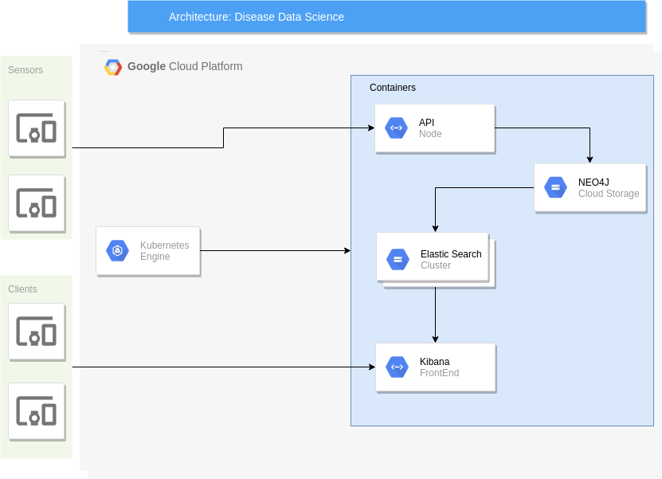

# TC3041 Proyecto  Final Primavera 2019

# *Disease Data Science*
---

##### Integrantes:
1. Axel Zuchovicki Zaritsky
2. Christian Aguilar Piña


---
## 1. Aspectos generales

### 1.1 Requerimientos técnicos

A continuación se mencionan los requerimientos técnicos mínimos del proyecto, favor de tenerlos presente para que cumpla con todos.

* El equipo tiene la libertad de elegir las tecnologías de desarrollo a utilizar en el proyecto, sin embargo, debe tener presente que la solución final se deberá ejecutar en una plataforma en la nube. Puede ser  [Google Cloud Platform](https://cloud.google.com/?hl=es), [Azure](https://azure.microsoft.com/en-us/) o AWS [AWS](https://aws.amazon.com/es/free/).
* El proyecto debe utilizar al menos dos modelos de bases de datos diferentes, de los estudiados en el curso.
* La solución debe utilizar una arquitectura de microservicios. Si no tiene conocimiento sobre este tema, le recomiendo la lectura [*Microservices*](https://martinfowler.com/articles/microservices.html) de [Martin Fowler](https://martinfowler.com).
* La arquitectura debe ser modular, escalable, con redundancia y alta disponibilidad.
* La arquitectura deberá estar separada claramente por capas (*frontend*, *backend*, *API RESTful*, datos y almacenamiento).
* Los diferentes componentes del proyecto (*frontend*, *backend*, *API RESTful*, bases de datos, entre otros) deberán ejecutarse sobre contenedores [Docker](https://www.docker.com/) y utilizar [Kubernetes](https://kubernetes.io/) como orquestador.
* Todo el código, *datasets* y la documentación del proyecto debe alojarse en un repositorio de GitHub siguiendo al estructura que aparece a continuación.

### 1.2 Estructura del repositorio
El proyecto debe seguir la siguiente estructura de carpetas:
```
- / 			        # Raíz de todo el proyecto
    - README.md			# Archivo con los datos del proyecto (este archivo)
    - frontend			# Carpeta con la solución del frontend (Web app)
    - backend			# Carpeta con la solución del backend (CMS)
    - api			# Carpeta con la solución de la API
    - datasets		        # Carpeta con los datasets y recursos utilizados (csv, json, audio, videos, entre otros)
    - dbs			# Carpeta con los modelos, catálogos y scripts necesarios para generar las bases de datos
    - models			# Carpeta donde se almacenarán los modelos de Machine Learning ya entrenados
    - docs			# Carpeta con la documentación del proyecto
        - stage_f               # Documentos de la entrega final
        - manuals               # Manuales y guías
```

### 1.3 Documentación  del proyecto

Como parte de la entrega final del proyecto, se debe incluir la siguiente información:

* Justificación de los modelo de *bases de datos* que seleccionaron.
* Descripción del o los *datasets* y las fuentes de información utilizadas.
* Guía de configuración, instalación y despliegue de la solución en la plataforma en la nube  seleccionada.
* Documentación de la API. Puede ver un ejemplo en [Swagger](https://swagger.io/).
* El código debe estar documentado siguiendo los estándares definidos para el lenguaje de programación seleccionado.

## 2. Descripción del proyecto

Este proyecto consiste en un simulador de enfermedades. Cada enfermedad está definida por:
  * Medio de transmisión
  * Tasa de curación
  * Tasa de infección

Utilizamos una 'población' de 10,000 personas y 30,000 relaciones entre sí. También, creamos diferentes programas que simulan ser sensores. Estos sensores son capaces de:
  * Crear nuevas personas
  * Crear nuevas relaciones
  * Crear nuevas infecciones
  * Propagar infecciones
  * Curar cierta infección en una persona afectada

Además, un programa nos permite simular una infección; permitiendo ver a tiempo real su comportamiento en nuestro frontend en Kibana.

Con este proyecto, utilizamos varias herramientas para crear un framework original y útil que permite el análisis del comportamiento de diferentes enfermedades.


## 3. Solución

A continuación aparecen descritos los diferentes elementos que forman parte de la solución del proyecto.

### 3.1 Modelos de *bases de datos* utilizados

Nuestro objetivo, al modelar este problema, era poder realizar un análisis de
diferentes enfermedades sobre una población determinada. Entonces necesitamos primero crear una población.

Las personas están descritas por:
1. ID: Inicia en 0, incremental.
2. Nombre: Nombre aleatorio.
3. Edad: Entre 0 y 100 años.

Después, para poder simular la propagación de la enfermedad, era necesario formar relaciones entre las personas en nuestra población. Las relaciones podían ser de tres tipos:
1. Familia
2. Vecino
3. Compañero de Trabajo

Una vez que tenemos la población descrita de esta manera, se pueden definir enfermedades:
1. Nombre
2. Tipo de propagación:
  * Aire
  * Fluidos
  * Tacto
3. Número de infectados

### 3.2 Arquitectura de la solución



### 3.3 Frontend

Para el frontend utilizamos [Kibana](https://www.elastic.co/products/kibana). Esta herramienta nos permite visualizar de manera interactiva el comportamiento de nuestras enfermedades. De igual manera, al estar sobre elasticsearch, permite visualizar cambios en propagación a tiempo real.

Así, fue simple crear nuestras diferentes visualizaciones dentro de la herramienta.

### 3.4 Backend

El Backend del proyecto fue dividido en dos diferentes Bases de Datos:
1. Neo4j
2. Elasticsearch

#### Neo4j
Neo4j nos permite guardar las relaciones entre personas de manera eficiente. Además, nos ayudó a simular la propagación de las enfermedades, ya que podemos encontrar cuales son las personas que estan infectadas con cierta enfermedad y buscar las conexiones entre ellas en tiempo constante.

#### Elasticsearch
Elasticsearch nos permite, en conjunto con Kibana, visualizar los datos sobre las diferentes enfermedades. Esta BD se alimenta de datos insertados en Neo4j. Después de recuperar estos datos, los indexa de cierta manera para que Kibana pueda visualizarlos correctamente.

#### 3.4.1 Lenguaje de programación
Neo4j configuration para la comunicación entre Neo4j y elasticsearch.
#### 3.4.2 Framework
1. Neo4j
2. Elasticsearch

#### 3.4.3 Librerías de funciones o dependencias
Para la comunicación entre Neo4j y elasticsearch se utilizó [este plugin](https://github.com/neo4j-contrib/neo4j-elasticsearch). Con este plugin, los datos insertados en Neo4j son copiados a tiempo real en nuestra BD de elasticsearch.

### 3.5 API

Nuestra API nos permite comunicación entre los sensores y nuestra BD. Por este medio, los sensores envían información a diferentes endpoints, para que la información sea procesada y guardada, para después ser visualizada.

#### 3.5.1 Lenguaje de programación
Se utilizó [Python 3.4](https://www.python.org/downloads/release/python-340/).

#### 3.5.2 Framework
El Framework utilzado fue [Flask](http://flask.pocoo.org/). Este framework nos permitió desarrollar el API de manera rápida, simple y ligera.

#### 3.5.3 Librerías de funciones o dependencias

Para poder comunicarse con Neo4j, se utilizó la librería de [py2neo v4](https://py2neo.org/v4/). Esta librería permite todas las operaciones sobre una BD en Neo4j.

#### 3.5.4 Endpoints

A continuación se presenta una lista con cada uno de los endpoints e información sobre ellos:
1. Person
  * **Descripción**: Manipulacion información sobre personas.
  * **URL**: `/person`
  * **Verbos HTTP**:
    * `POST`
      * **Headers**: NA
      * **Formato JSON del cuerpo de la solicitud**: `{"edad:INT", "name:TEXT"}`
      * **Formato JSON de la respuesta**: `{"message:TEXT", "data:TEXT"}`
    * `GET`
      * **Headers**: NA
      * **Formato JSON del cuerpo de la solicitud**: NA
      * **Formato JSON de la respuesta**: `{"message:TEXT", "count:INT"}`
2. Relation
  * **Descripción**: Manipulación de información sobre relaciones.
  * **URL**: `/relation`
  * **Verbos HTTP**:
    * `POST`
      * **Headers**: NA
      * **Formato JSON del cuerpo de la solicitud**: `{"relation:TEXT", "first_id:INT", "second_id:INT"}`
      * **Formato JSON de la respuesta**: `{"message:TEXT", "data:TEXT"}`
3. Disease
  * **Descripción**: Manipulación sobre información de enfermedades
  * **URL**:`/disease`
  * **Verbos HTTP**:
    * `POST`
      * **Headers**: NA
      * **Formato JSON del cuerpo de la solicitud**: `{"name:TEXT", "spread_type:TEXT", "infected_id:INT"}`
      * **Formato JSON de la respuesta**: `{"message:TEXT", "data:TEXT", "id:INT"}`
    * `GET`
      * **Headers**: NA
      * **Formato JSON del cuerpo de la solicitud**: NA
      * **Formato JSON de la respuesta**: `{"message:TEXT", "count:INT"}`
4. Spread
  * **Descripción**: Propagación de enfermedades
  * **URL**:`/spread`
  * **Verbos HTTP**:
    * `POST`
      * **Headers**: NA
      * **Formato JSON del cuerpo de la solicitud**: `{"id:INT"}`
      * **Formato JSON de la respuesta**: `{"message:TEXT", "data:TEXT"}`
5. Cure
  * **Descripción**: Curar a una persona de una enfermedad.
  * **URL**: `/cure`
  * **Verbos HTTP**:
    * `POST`
      * **Headers**: NA
      * **Formato JSON del cuerpo de la solicitud**: `{"id:INT"}`
      * **Formato JSON de la respuesta**: `{"message:TEXT", "data:TEXT"}`
    * `GET`
      * **Headers**: NA
      * **Formato JSON del cuerpo de la solicitud**: `{"id:INT"}`
      * **Formato JSON de la respuesta**: `{"message:TEXT", "count:INT"}`

## 3.6 Pasos a seguir para utilizar el proyecto

1. Crear un proyecto nuevo en GCP.

2. Clonar el repostorio:

  `git clone https://github.com/tec-csf/TC3041-PF-Primavera-2019-equipo-9.git`

3. Hacer el build de los contenedores de Neo4j y API:

  `docker build -t gcr.io/<nombre_del_proyecto>/neo4j backend/neo4j .`

  `docker build -t gcr.io/<nombre_del_proyecto>/api api/.`

4. Hacer login a GCP desde la terminal con el comando:

  `gcloud auth login`

5. Hacer push de los contenedores a Cloud:

  `docker push gcr.io/<nombre_del_proyecto/neo4j`
  `docker push gcr.io/<nombre_del_proyecto/api`

6. Crear un cluster de 6 nodos en Kubernetes en Google Cloud.

7. Conectarse al cluster desde la terminal, ejecutando el comando que aparece en `Connect` dentro de la página de Google Cloud.

8. Ejecutar estos dos comandos para crear los primeros contenedores y reservar volúmenes para elasticsearch.

  `kubectl apply -f kubernetes/1_k8s-global`

  `kubectl apply -f kubernetes/2_elasticsearch`

9. Una vez que se levanten esos contenedores, ejecutar los siguientes comandos para terminar de desplegar la solución.

  `kubectl apply -f kubernetes/3_kibana`

  `kubectl apply -f kubernetes/4_api-neo4j`

10. Después de unos minutos, debe ser posible conectarse al endpoint de Kibana.

11. Si se quiere insertar datos, puede correr cualquiera de los archivos en `/sensors`, modificando la IP address por la IP de la API en Google Cloud.

## 4. Referencias

* https://github.com/vcubells/kubernetes-examples
* https://swagger.io/
* https://py2neo.org/v4/
* https://github.com/neo4j-contrib/neo4j-elasticsearch
* https://engineering.udacity.com/high-performance-elk-with-kubernetes-part-1-1d09f41a4ce2
* http://flask.pocoo.org/
